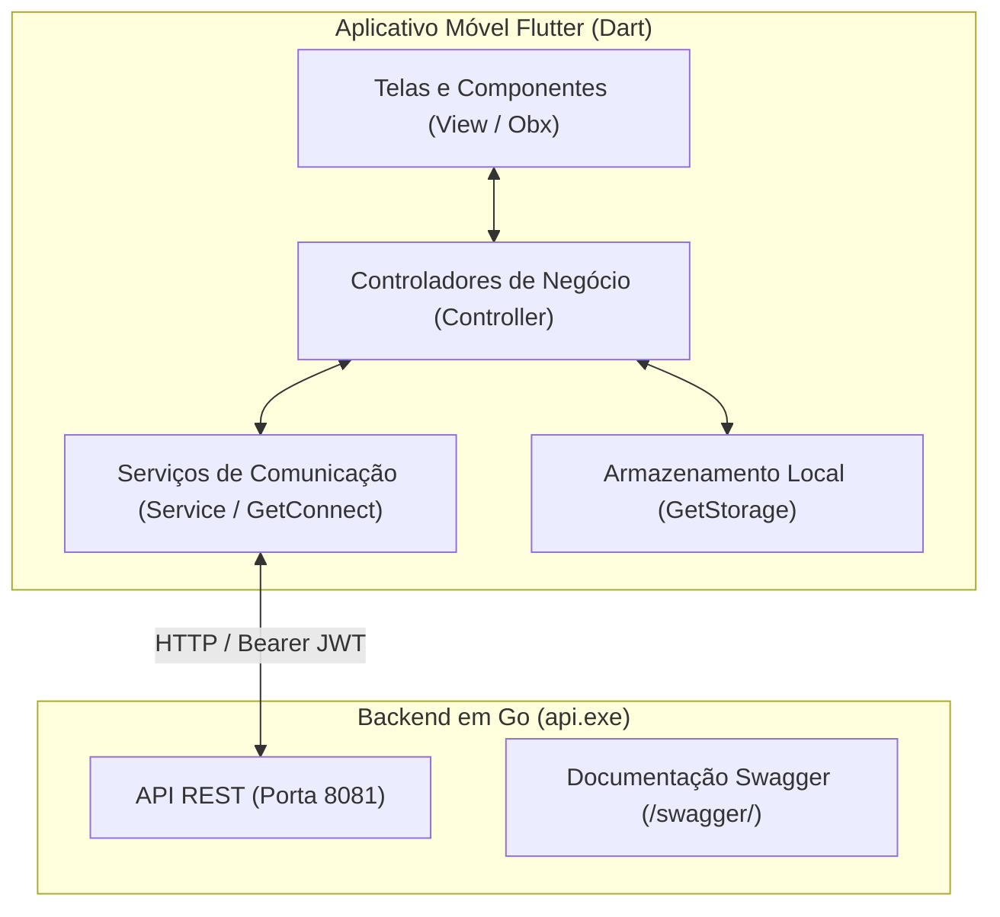

# Sistema Integrado de Gestão de Patrimônio Escolar

Aplicativo móvel em **Flutter (Dart)** integrado a uma API REST em **Go (Golang)** para a administração, acompanhamento, atribuição e inventário de bens patrimoniais escolares.

---

## 1. Visão Geral do Projeto

A solução foi projetada para atender às necessidades de controle de bens materiais em instituições escolares (computadores, projetores, instrumentos de laboratório, equipamentos esportivos e mobiliário). 

O sistema separa estritamente as operações entre a **Coordenação (Administrador)**, que realiza a gestão global do inventário e corpo docente, e os **Professores (Docentes)**, que realizam a conferência dos bens sob sua guarda.



---

## 2. Arquitetura da Aplicação (MVC + GetX)

O aplicativo adota a arquitetura **MVC (Model - View - Controller)** com gerenciamento de estado reativo e injeção de dependências desacoplada via **GetX**:

- **Modelos (`dados/modelos`):** Representação tipada das entidades do domínio (`UsuarioModelo`, `PatrimonioModelo`, `ProfessorModelo`, `HistoricoMovimentacaoModelo`, `EstatisticasPainelModelo`).
- **Controladores (`controladores`):** Cérebro da interface. Gerenciam os estados reativos (`RxBool carregando`, `RxList`), validações de formulários, tratamento de respostas da API e redirecionamentos.
- **Serviços (`dados/servicos`):** Clientes de rede utilizando `GetConnect` (`ApiServico`, `AutenticacaoServico`, `PatrimonioServico`, etc.) e persistência local (`ArmazenamentoServico`).
- **Vinculações (`vinculacoes`):** Injeção de dependências (`Bindings`) instanciadas sob demanda conforme as rotas acessadas.
- **Rotas (`rotas`):** Navegação nomeada e transições configuradas de forma centralizada (`RotasApp` e `PaginasApp`).

---

## 3. Atores do Sistema e Controle de Acesso (RBAC)

```
                            ┌────────────────────────────────────┐
                            │        SISTEMA DE PATRIMÔNIO       │
                            └────────────────────────────────────┘
                                               │
                       ┌────────────────────────┴────────────────────────┐
                       ▼                                                 ▼
        ┌─────────────────────────────┐                   ┌─────────────────────────────┐
        │    COORDENADOR (ADMIN)      │                   │     PROFESSOR (DOCENTE)     │
        ├─────────────────────────────┤                   ├─────────────────────────────┤
        │ • Auto-cadastro inicial     │                   │ • Cadastrado pelo admin     │
        │ • Gestão de professores     │                   │ • Consulta SEUS patrimônios │
        │ • Gestão de patrimônios     │                   │ • Permissão APENAS LEITURA  │
        │ • Atribuição e Devolução    │                   │ • Atualiza dados de contato │
        │ • Dashboard com métricas    │                   │ • Redefine senha pessoal    │
        └─────────────────────────────┘                   └─────────────────────────────┘
```

> **Nota de Regra de Negócio:** Os alunos da instituição não são operadores do sistema. Os bens ficam sob custódia direta dos docentes ou no almoxarifado sob controle da coordenação.

---

## 4. Regras de Negócio Fundamentais

- **[RN01] Auto-Cadastro Exclusivo para Coordenador:** A rota pública de cadastro cria apenas contas de perfil `admin`.
- **[RN02] Cadastro Centralizado de Professores:** O Coordenador cadastra o docente com matrícula, departamento, contato e define a senha provisória de acesso.
- **[RN03] Permissão Estrita de Apenas Leitura para Docentes:** O professor visualiza apenas os bens sob sua responsabilidade, sem ações de mutação (bloqueio `403 Forbidden` no backend em tentativas indevidas).
- **[RN04] Multiplicidade de Patrimônios:** Um professor pode ser responsável por múltiplos bens simultaneamente.
- **[RN05] Ciclo de Vida (Atribuição e Devolução):**
  - *Atribuição:* associa o bem ao docente e altera seu status para `em_uso`.
  - *Devolução:* retorna o bem ao status `disponivel` no estoque com registro obrigatório de motivo.
- **[RN06] Autonomia do Perfil Docente:** O professor pode atualizar seus telefones de contato, departamento e alterar sua senha de acesso a qualquer momento.
- **[RN07] Isolamento Multi-Tenant:** Cada coordenador gerencia estritamente o ecossistema da sua instituição escolar.

---

## 5. Mapeamento de Rotas e Endpoints

| Rota no App (`RotasApp`) | Endpoint no Backend | Controlador Responsável | Acesso | Descrição |
| :--- | :--- | :--- | :--- | :--- |
| `/login` | `POST /api/auth/login` | `AutenticacaoControlador` | Público | Login unificado (Admin e Professor) |
| `/cadastro` | `POST /api/auth/register` | `AutenticacaoControlador` | Público | Auto-cadastro de Coordenador |
| `/esqueci-senha` | `POST /api/auth/forgot-password` | `AutenticacaoControlador` | Público | Solicitação de código de 6 dígitos |
| `/validar-codigo` | `POST /api/auth/verify-code` | `AutenticacaoControlador` | Público | Validação do código de recuperação |
| `/redefinir-senha` | `POST /api/auth/reset-password` | `AutenticacaoControlador` | Público | Redefinição de senha |
| `/admin/painel` | `GET /api/admin/stats` | `PainelControlador` | Coordenador | Dashboard com indicadores gerais |
| `/admin/patrimonios` | `GET /api/patrimonios` | `PatrimonioControlador` | Coordenador | Listagem, busca e filtros de bens |
| `/admin/patrimonios/novo` | `POST /api/patrimonios` | `PatrimonioControlador` | Coordenador | Cadastro de novo patrimônio |
| `/admin/patrimonios/detalhes`| `GET /api/patrimonios/{id}/historico` | `PatrimonioControlador` | Coordenador | Detalhes e linha do tempo de movimentações |
| Modal Atribuição | `POST /api/patrimonios/{id}/atribuir` | `PatrimonioControlador` | Coordenador | Atribuir bem ao docente (`em_uso`) |
| Modal Devolução | `POST /api/patrimonios/{id}/devolver` | `PatrimonioControlador` | Coordenador | Devolver bem ao estoque (`disponivel`) |
| `/admin/professores` | `GET /api/admin/professores` | `ProfessorControlador` | Coordenador | Listagem de docentes e contagem de bens |
| `/admin/professores/novo` | `POST /api/admin/professores` | `ProfessorControlador` | Coordenador | Cadastro de professor com senha provisória |
| `/admin/professores/detalhes`| `GET /api/admin/professores/{id}` | `ProfessorControlador` | Coordenador | Bens sob tutela do professor |
| `/docente/meus-patrimonios` | `GET /api/patrimonios` | `MeusPatrimoniosControlador` | Professor | Consulta somente leitura de bens vinculados |
| `/perfil` | `GET` e `PUT /api/profile` | `PerfilControlador` | Admin e Docente | Atualização cadastral e troca de senha |

---

## 6. Estrutura do Código-Fonte

```
lib/
├── app/
│   ├── controladores/             # Lógica de controle e gerenciamento de estado
│   │   ├── autenticacao_controlador.dart
│   │   ├── painel_controlador.dart
│   │   ├── patrimonio_controlador.dart
│   │   ├── professor_controlador.dart
│   │   ├── meus_patrimonios_controlador.dart
│   │   └── perfil_controlador.dart
│   ├── dados/
│   │   ├── modelos/               # Modelos de dados com parsing JSON
│   │   │   ├── usuario_modelo.dart
│   │   │   ├── patrimonio_modelo.dart
│   │   │   ├── professor_modelo.dart
│   │   │   ├── historico_movimentacao_modelo.dart
│   │   │   └── estatisticas_painel_modelo.dart
│   │   └── servicos/              # Clientes de rede HTTP e persistência
│   │       ├── api_servico.dart
│   │       ├── armazenamento_servico.dart
│   │       ├── autenticacao_servico.dart
│   │       ├── painel_servico.dart
│   │       ├── patrimonio_servico.dart
│   │       ├── professor_servico.dart
│   │       └── perfil_servico.dart
│   ├── rotas/
│   │   ├── paginas_app.dart       # Definição de GetPages e transições
│   │   └── rotas_app.dart         # Constantes das rotas nomeadas
│   └── vinculacoes/               # Injeção de dependências do GetX
│       ├── inicial_vinculacao.dart
│       ├── autenticacao_vinculacao.dart
│       ├── painel_vinculacao.dart
│       ├── patrimonio_vinculacao.dart
│       ├── professor_vinculacao.dart
│       ├── meus_patrimonios_vinculacao.dart
│       └── perfil_vinculacao.dart
├── main.dart                      # Inicialização do GetMaterialApp
└── pubspec.yaml                   # Dependências do projeto Flutter
```

---

## 7. Instruções para Execução

### 1. Executar o Backend Go
1. Execute o arquivo executável `api.exe` disponibilizado para a aplicação.
2. O servidor ficará ativo na porta `8081`.
3. A documentação interativa Swagger pode ser acessada em:
   ```
   http://localhost:8081/swagger/
   ```

### 2. Configurar a URL de Comunicação no Mobile
- **Emulador Android Oficial:** `http://10.0.2.2:8081/api` *(padrão configurado)*.
- **Simulador iOS / Web:** `http://localhost:8081/api`.
- **Dispositivo Físico:** `http://<IP_DA_MAQUINA_LOCAL>:8081/api`.

### 3. Executar o Aplicativo Flutter
```bash
# Obter dependências do projeto
flutter pub get

# Executar a aplicação no dispositivo/emulador conectado
flutter run
```